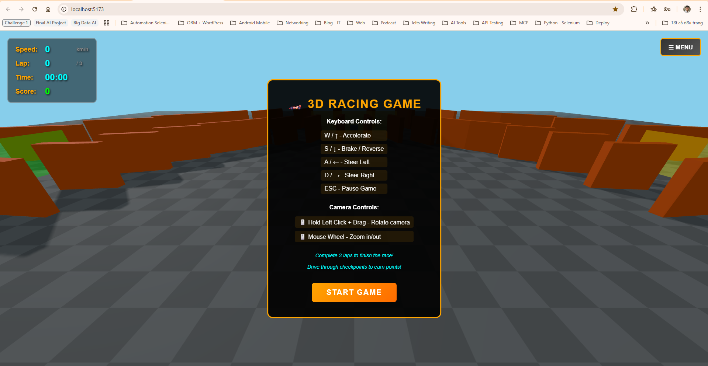
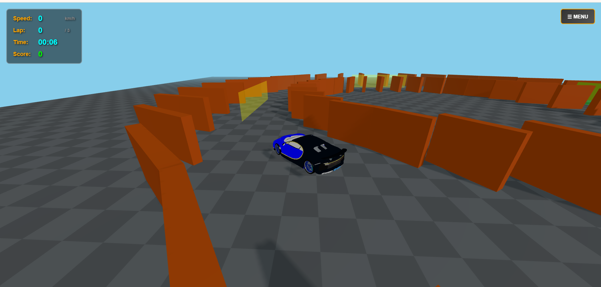
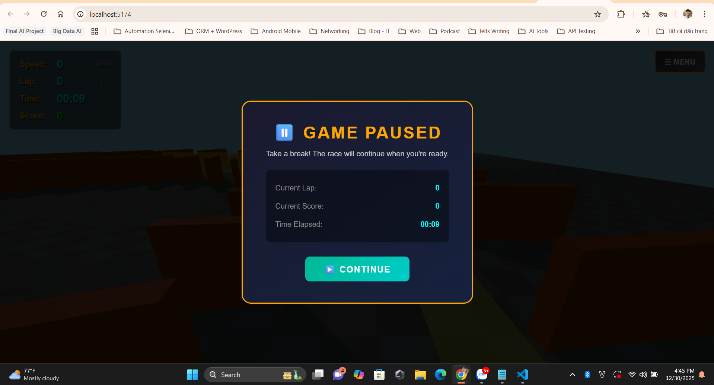
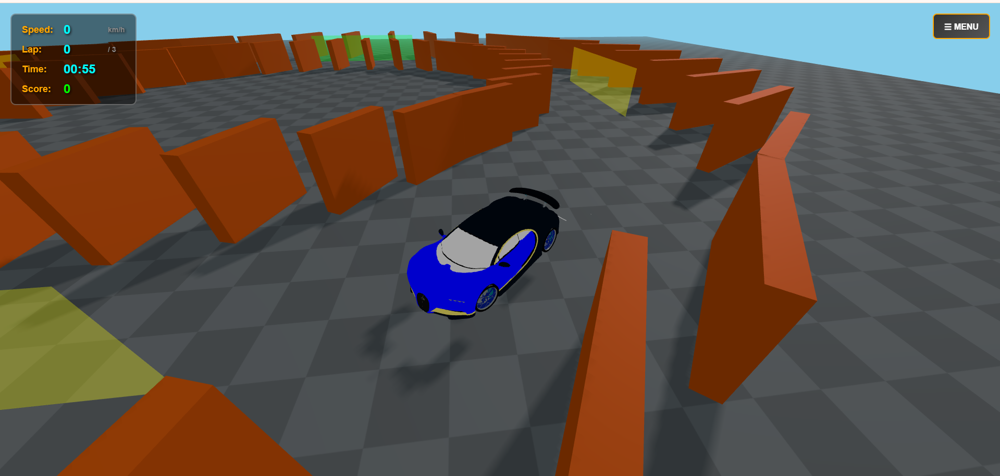
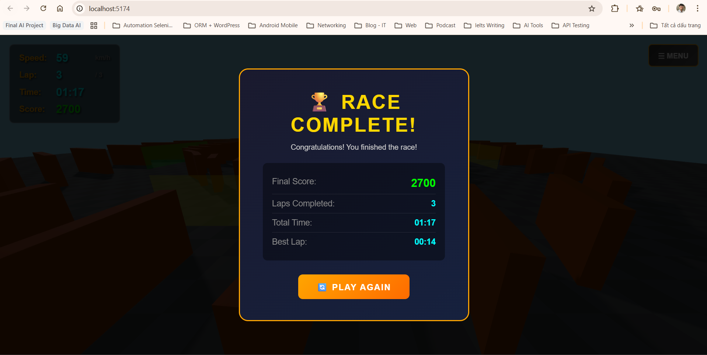

# 🏎️ 3D Racing Game - Three.js Challenge 1

[](https://opensource.org/licenses/MIT)
[](https://threejs.org/)
[](https://pmndrs.github.io/cannon-es/)
[](https://vitejs.dev/)
[](https://nodejs.org/)

> A 3D car racing game prototype built with Three.js for rendering and Cannon-es for physics simulation. Features realistic Bugatti car model, physics-based collision detection, orbit camera controls, and a complete scoring system.

**Author:** Le Tiep Tuyen  
**Student ID:** 22020015  
**Course:** 3D Programming - Three.js  
**Date:** November 2025

---

## 🎬 Demo Video

🔗 **[Watch Demo Video on Google Drive](https://drive.google.com/file/d/1UL-67cvA8wjS04THGqKGHlQL7D-HEwUF/view?usp=drive_link)**


---

## 📸 Screenshots


| Game Start | Gameplay | Pause Menu |
|:----------:|:--------:|:----------:|
|  |  |  |

| Camera Angles | Game Over |
|:-------------:|:---------:|
|  |  | 


---

## 📋 Table of Contents

- [Project Overview](#-project-overview)
- [Features](#-features)
- [Technologies Used](#️-technologies-used)
- [Project Structure](#-project-structure)
- [Installation and Setup](#-installation-and-setup)
- [Game Rules](#-game-rules)
- [Controls Guide](#-controls-guide)
- [Game Mechanics](#-game-mechanics)
- [Architecture Details](#️-architecture-details)
- [Customization Options](#-customization-options)
- [Troubleshooting](#-troubleshooting)
- [License](#-license)
- [Author Information](#-author-information)

---

## 📋 Project Overview

This is a **3D car racing game prototype** built with modern web technologies. The game features:

- A circular racing track with physics-based wall collisions
- A realistic **Bugatti car model** loaded from OBJ/MTL files
- **Orbit camera controls** with mouse drag and zoom
- **Lap counting** with checkpoint system
- **Scoring system** with speed bonuses
- Complete **UI/Menu system** with Pause, Restart, and Game Over screens
- Smooth camera following with **double smoothing** to prevent jitter

The goal is to complete **2 laps** around the track, passing through all checkpoints in order to win the race!

---

## ✨ Features

### Core Features
| Feature | Description | Status |
|---------|-------------|:------:|
| **3D Environment** | Fully rendered 3D scene with ground, walls, and racing track | ✅ |
| **Physics Simulation** | Realistic physics powered by Cannon-es with gravity and collisions | ✅ |
| **Bugatti Car Model** | High-quality OBJ model with MTL materials | ✅ |
| **Car Controls** | Smooth WASD/Arrow key controls with physics-based collision | ✅ |
| **Orbit Camera** | Mouse-controlled camera with drag rotation and scroll zoom | ✅ |
| **Lap Detection** | Checkpoint system for automatic lap counting | ✅ |
| **Scoring System** | Points for checkpoints with speed bonus multiplier | ✅ |
| **HUD Display** | Real-time display of speed, lap, timer, and score | ✅ |
| **Menu System** | Pause, Resume, Restart, and Game Over functionality | ✅ |
| **Visual Polish** | Shadows, lighting, fog, and smooth animations | ✅ |

### Bonus Features Implemented
| Feature | Description | Status |
|---------|-------------|:------:|
| **UI Menu** | Complete menu with Restart, Pause/Continue buttons | ✅ |
| **Game Over Screen** | Victory screen with final stats and Play Again option | ✅ |
| **Scoring System** | Points per checkpoint + lap bonus + speed multiplier | ✅ |
| **ESC Key Pause** | Quick pause/resume with Escape key | ✅ |
| **Camera Controls** | Full orbit camera with mouse interaction | ✅ |
| **3D Car Model** | Imported Bugatti OBJ model with materials | ✅ |
| **Wall Collision** | Physics-based collision prevents passing through walls | ✅ |

### Technical Implementation
- ✅ Modular architecture with ES6 classes
- ✅ Physics-visual synchronization for accurate representation
- ✅ Fixed time-step physics simulation (60 FPS) for stability
- ✅ Double smoothing camera system to prevent jitter
- ✅ Velocity-based movement with physics collision detection
- ✅ OBJ/MTL model loading with automatic scaling
- ✅ Responsive design with window resize handling

---

## 🛠️ Technologies Used

| Library | Version | Purpose | Documentation |
|---------|:-------:|---------|:-------------:|
| **Three.js** | ^0.160.0 | 3D rendering engine | [Docs](https://threejs.org/docs/) |
| **Cannon-es** | ^0.20.0 | Physics simulation | [Docs](https://pmndrs.github.io/cannon-es/) |
| **Vite** | ^5.0.0 | Build tool and dev server | [Docs](https://vitejs.dev/) |
| **OBJLoader** | Three.js | Loading 3D car model | [Docs](https://threejs.org/docs/#examples/en/loaders/OBJLoader) |
| **MTLLoader** | Three.js | Loading model materials | [Docs](https://threejs.org/docs/#examples/en/loaders/MTLLoader) |

---

## 📁 Project Structure

```
3D-Challenge1/
├── 📂 src/
│   ├── 📂 Car/
│   │   └── CarController.js      # Bugatti model + physics-based movement
│   ├── 📂 World/
│   │   ├── PhysicsWorld.js       # Cannon-es physics world setup
│   │   └── Environment.js        # Track, ground, walls, checkpoints
│   ├── 📂 Utils/
│   │   ├── InputManager.js       # Keyboard input handling
│   │   └── GameLogic.js          # Lap counting, scoring, game state
│   └── main.js                   # Main entry point, camera, UI, game loop
│
├── 📂 assets/
│   ├── 📂 textures/              # Texture files
│   └── 📂 models/
│       └── 📂 bugatti/           # Bugatti OBJ model files
│           ├── bugatti.obj
│           ├── bugatti.mtl
│           └── README.txt
│
├── 📂 demo/                      # Screenshots for documentation
│   └── .gitkeep
│
├── 📄 index.html                 # HTML entry with HUD and overlays
├── 📄 style.css                  # Complete UI/Menu/Overlay styling
├── 📄 package.json               # Dependencies and scripts
├── 📄 README.md                  # This documentation file
├── 📄 GAME_RULES.md              # Detailed game rules and mechanics
└── 📄 challenge-1-requirements.md # Original requirements
```

---

## 🚀 Installation and Setup

### Prerequisites
- **Node.js** v16 or higher ([Download](https://nodejs.org/))
- **npm** (comes with Node.js)
- Modern web browser (Chrome, Firefox, Edge recommended)

### Quick Start

```bash
# 1. Clone the repository (or navigate to project folder)
cd "3D-Challenge1"

# 2. Install dependencies
npm install

# 3. Start the development server
npm run dev

# 4. Open your browser
# Vite will display a URL (typically http://localhost:5173)
```

### Build for Production

```bash
# Build optimized version
npm run build

# Preview production build
npm run preview
```

---

## 📖 Game Rules

> ⚠️ **IMPORTANT: Please read the game rules before playing!**

For detailed game rules, scoring system, and win conditions, please refer to:

### 📜 **[GAME_RULES.md](GAME_RULES.md)**

Quick summary:
- 🏁 Complete **2 laps** to win the race
- 🎯 Pass through **4 checkpoints** in order per lap
- 💰 Earn **100 points** per checkpoint (200 at high speed!)
- ⭐ Get **500 bonus points** per completed lap
- ⏸️ Press **ESC** to pause anytime

---

## 🎮 Controls Guide

### Keyboard Controls

| Key | Action |
|:---:|--------|
| **W** / **↑** | Accelerate forward |
| **S** / **↓** | Brake / Reverse |
| **A** / **←** | Steer left |
| **D** / **→** | Steer right |
| **ESC** | Pause / Resume game |

### Mouse Controls (Camera)

| Action | Description |
|--------|-------------|
| **Hold Left Click + Drag** | Rotate camera around the car |
| **Mouse Wheel Scroll** | Zoom in/out |

### Menu Options

| Button | Action |
|--------|--------|
| **☰ MENU** | Open/close menu dropdown |
| **🔄 Restart** | Reset race from beginning |
| **⏸️ Pause** | Pause current game |
| **▶️ Continue** | Resume from pause |
| **🔄 Play Again** | Start new race (after game over) |

---

## 🎯 Game Mechanics

### Car Physics
| Property | Value | Description |
|----------|:-----:|-------------|
| **Mass** | 1500 kg | Heavy for stable physics |
| **Max Speed** | 180 km/h | Forward maximum velocity |
| **Max Reverse** | 72 km/h | Backward maximum velocity |
| **Acceleration** | 25 units/s | Speed increase rate |
| **Braking** | 40 units/s | Deceleration rate |
| **Steering Speed** | 2.5 rad/s | Turning rate |

### Collision System
- **Physics-based collision** with track walls
- Car uses velocity-based movement (not position-based)
- Collision events stop car from passing through barriers
- Physics body size: 3 × 1.5 × 6 units

### Scoring System
| Action | Points |
|--------|:------:|
| Checkpoint (normal) | +100 |
| Checkpoint (>100 km/h) | +200 |
| Lap completion | +500 |

### Camera System
- **Double smoothing** algorithm prevents jitter
- **Spherical coordinates** for orbit rotation
- Configurable distance: 8-40 units
- Vertical angle constraints: 0.2 - 1.43 radians

---

## 🏗️ Architecture Details

### Class Overview

```
RacingGame (main.js)
├── CarController ────► Physics body + Bugatti model
├── Environment ──────► Track, walls, checkpoints  
├── PhysicsWorld ─────► Cannon-es world management
├── InputManager ─────► Keyboard event handling
└── GameLogic ────────► Scoring, laps, game state
```

#### `CarController` (src/Car/CarController.js)
- Loads Bugatti OBJ model with MTL materials
- Filters unwanted meshes (studio lights, backdrop)
- Creates physics body with collision detection
- Implements velocity-based movement for accurate collision
- Syncs visual model with physics body position

#### `Environment` (src/World/Environment.js)
- Creates circular track with inner/outer walls
- Places 4 checkpoints around the track
- Generates checkerboard ground texture
- Adds physics bodies for all obstacles

#### `GameLogic` (src/Utils/GameLogic.js)
- Manages lap counting and checkpoint detection
- Handles scoring with speed bonus multiplier
- Controls game state (start, pause, resume, reset)
- Triggers game over callbacks

#### `RacingGame` (src/main.js)
- Main orchestrator class
- Implements orbit camera with double smoothing
- Manages all UI overlays and menus
- Runs animation loop with physics updates

---

## 🎨 Customization Options

### Car Properties
Edit `src/Car/CarController.js`:
```javascript
this.maxForwardSpeed = 50;    // Max forward speed (m/s)
this.maxReverseSpeed = 20;    // Max reverse speed (m/s)
this.accelerationRate = 25;   // Acceleration rate
this.brakeRate = 40;          // Braking rate
this.steeringSpeed = 2.5;     // Turning speed
```

### Track Dimensions
Edit `src/World/Environment.js`:
```javascript
this.trackRadius = 50;        // Track circle radius
this.trackWidth = 20;         // Track width
this.wallHeight = 5;          // Wall height
```

### Camera Settings
Edit `src/main.js`:
```javascript
this.cameraDistance = 18;      // Distance from car
this.cameraSmoothing = 0.08;   // Position smoothing
this.targetSmoothing = 0.12;   // LookAt smoothing
this.minDistance = 8;          // Min zoom distance
this.maxDistance = 40;         // Max zoom distance
```

### Game Settings
Edit `src/Utils/GameLogic.js`:
```javascript
this.totalLaps = 2;            // Laps to win
this.checkpointPoints = 100;   // Points per checkpoint
this.lapBonusPoints = 500;     // Bonus per lap
this.speedBonusMultiplier = 2; // High speed multiplier
```

---

## 🐛 Troubleshooting

| Issue | Solution |
|-------|----------|
| **Game doesn't start** | Check browser console (F12) for errors. Run `npm install`. |
| **Black screen** | WebGL may be disabled. Try another browser. |
| **Car passes through walls** | This should be fixed. If occurs, refresh page. |
| **Camera is jittery** | Double smoothing should prevent this. Check `cameraSmoothing` value. |
| **Model doesn't load** | Check `/assets/models/bugatti/` folder has OBJ/MTL files. |
| **Controls unresponsive** | Click on the game window first. Check if game is paused. |
| **Low FPS** | Reduce browser window size or lower shadow quality. |

---

## 📊 Performance Considerations

| Setting | Value | Purpose |
|---------|:-----:|---------|
| Physics Time Step | 1/60s | Stable simulation |
| Shadow Map Size | 2048×2048 | Quality vs performance |
| Pixel Ratio | Max 2 | Prevent excessive GPU load |
| Fog | 50-200 units | Reduce distant rendering |

---

## 📄 License

This project is licensed under the **MIT License** - see details below:

```
MIT License

Copyright (c) 2024 Le Tiep Tuyen

Permission is hereby granted, free of charge, to any person obtaining a copy
of this software and associated documentation files (the "Software"), to deal
in the Software without restriction, including without limitation the rights
to use, copy, modify, merge, publish, distribute, sublicense, and/or sell
copies of the Software, and to permit persons to whom the Software is
furnished to do so, subject to the following conditions:

The above copyright notice and this permission notice shall be included in all
copies or substantial portions of the Software.

THE SOFTWARE IS PROVIDED "AS IS", WITHOUT WARRANTY OF ANY KIND, EXPRESS OR
IMPLIED, INCLUDING BUT NOT LIMITED TO THE WARRANTIES OF MERCHANTABILITY,
FITNESS FOR A PARTICULAR PURPOSE AND NONINFRINGEMENT. IN NO EVENT SHALL THE
AUTHORS OR COPYRIGHT HOLDERS BE LIABLE FOR ANY CLAIM, DAMAGES OR OTHER
LIABILITY, WHETHER IN AN ACTION OF CONTRACT, TORT OR OTHERWISE, ARISING FROM,
OUT OF OR IN CONNECTION WITH THE SOFTWARE OR THE USE OR OTHER DEALINGS IN THE
SOFTWARE.
```

---

## 👨‍💻 Author Information

| | |
|---|---|
| **Name** | Le Tiep Tuyen |
| **Student ID** | 22020015 |
| **Course** | 3D Programming - Three.js |
| **Project** | Challenge 1 - 3D Racing Game Prototype |
| **GitHub** | [LeTiepTuyen/3D-Racing-Game-ThreeJS](https://github.com/LeTiepTuyen/3D-Racing-Game-ThreeJS) |

---

## 🔗 References

- [Three.js Documentation](https://threejs.org/docs/)
- [Cannon-es Documentation](https://pmndrs.github.io/cannon-es/)
- [Vite Documentation](https://vitejs.dev/)
- [OBJLoader Guide](https://threejs.org/docs/#examples/en/loaders/OBJLoader)
- [MTLLoader Guide](https://threejs.org/docs/#examples/en/loaders/MTLLoader)

---

## 📝 Changelog

### Version 1.0.0 
- ✅ Initial release with all core features
- ✅ Bugatti OBJ model integration
- ✅ Physics-based collision detection
- ✅ Orbit camera with double smoothing
- ✅ Complete UI/Menu system
- ✅ Scoring system with speed bonuses
- ✅ ESC key pause functionality

---

<div align="center">

**🏁 Happy Racing! 🏁**

*This project was created as part of the "3D Programming - Three.js - Challenge 1" assignment.*


</div>
